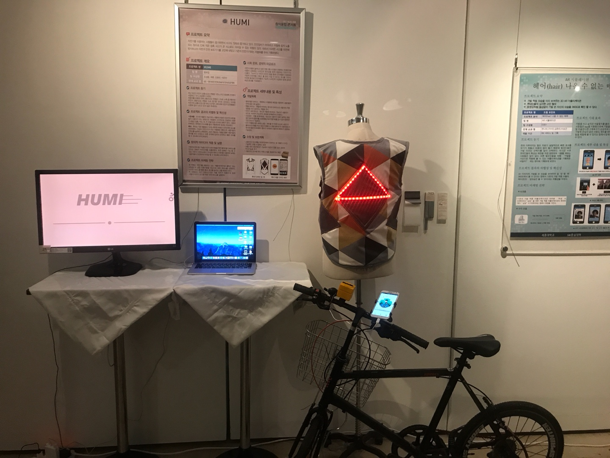
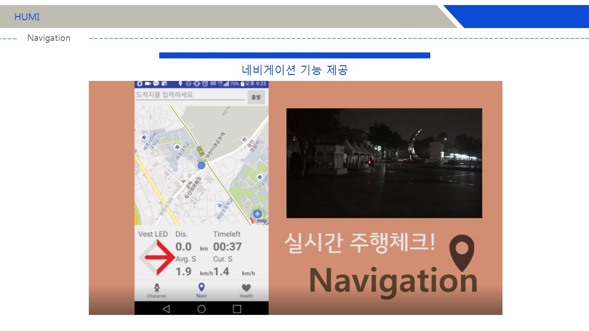
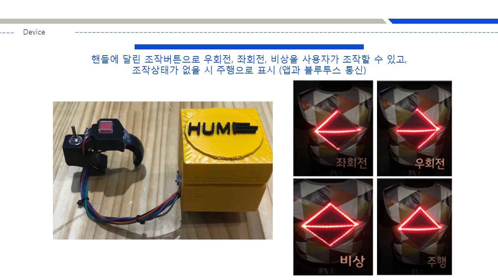
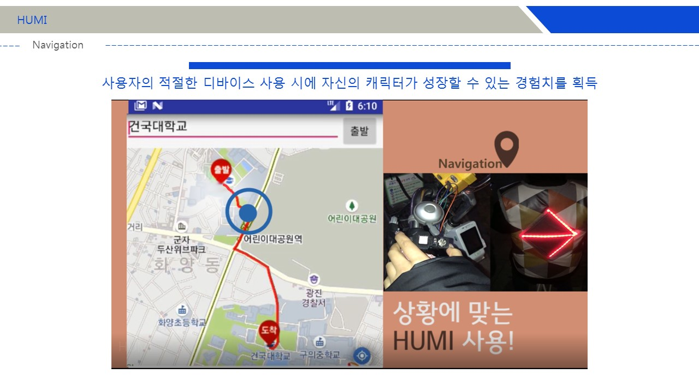
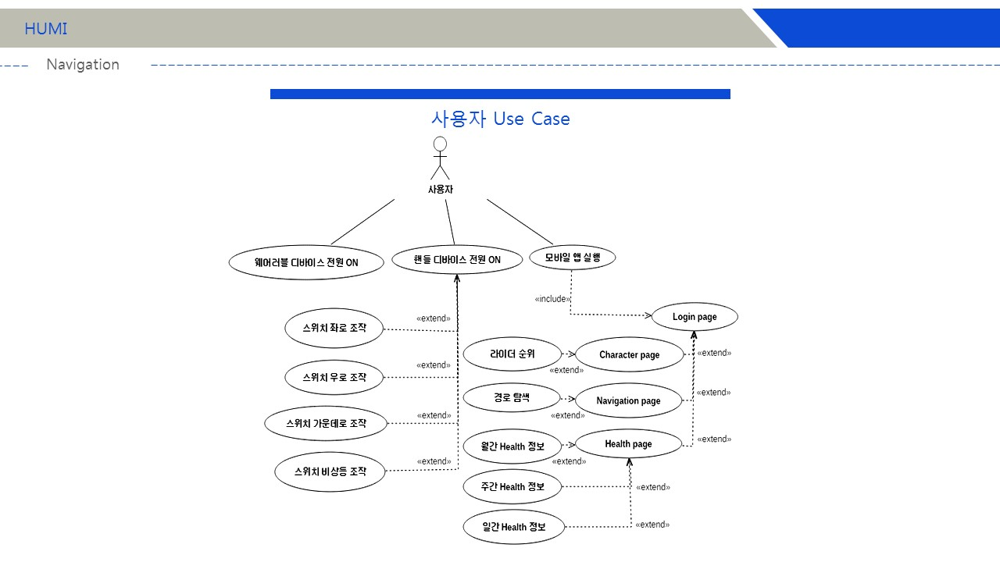

# BikeApp_HUMI
- 2017-09 ~ 2017-12
- 3학년 2학기 ES-엔터테인먼트SW미디어프로젝트
- 4인 개발 / **조성동** : Wearable Device(lilypad), Android App
- Java / Android
- 자전거 안전주행을 주제로 Arduino를 결합한 Remote Control, Wearable Device와 Android App을 개발함.

